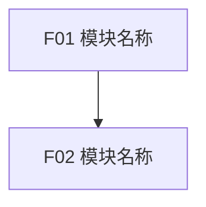

# 02 PRD（模板）

> 本文件是 PRD 文档的填写模板。正式生成 `<项目名><版本号>-02-PRD.md` 时，从本模板复制结构并按节填写；**本说明文字不输出到正式文档**。
> 各章生成指引见 [references/step2-prd/](../references/step2-prd/)，章节编号以本模板为准。

## 文档信息

| 字段 | 内容 |
|------|------|
| 产品名称 | |
| 迭代版本号 | |
| 负责人 | |
| 来源定型稿 | `<项目名><版本号>-01-产品规划.md` |
| 日期 | |
| 状态 | 起草中 / 已完成 |

## PRD 修改记录

| 时间 | 变更单元 | 动作 | 评审状态 | 备注 |
|------|----------|------|----------|------|
|      |          |      | 待确认 / 已确认 / 需调整 |      |

---

## 1、项目背景与基本情况

### 1.1 背景

> 产品产生背景、业务现状、现有问题、定型稿来源和本 PRD 的写作依据。避免营销化描述，重点写清为什么要做。

### 1.2 需求基本情况

| 维度 | 内容 |
|------|------|
| 需求方 | |
| 涉及部门/角色 | |
| 现状描述 | |
| 问题与痛点 | |

## 2、目标与收益

> 承接产品规划的**实现价值**（用户价值 / 业务价值 / 商业价值）。

### 2.1 项目目标

| 目标类型 | 目标描述 | 衡量指标 | 目标值 | 达成时限 |
|----------|----------|----------|--------|----------|
| 核心业务目标 | | | | |
| 效率目标 | | | | |
| 体验目标 | | | | |

### 2.2 验收标准与成功标准

- 验收标准（项目交付时检查）：
- 成功标准（上线运营后评估）：

### 2.3 商业分析（如适用）

> 商业化产品：目标市场与客户分析 + 竞品分析 + 差异化定位；企业自研：同类系统调研 + 业务痛点优先级。详见 [references/step2-prd/ch02-目标与收益.md](../references/step2-prd/ch02-目标与收益.md)。

## 3、方案概述

### 3.1 产品方案概述

> 产品形态、整体思路、关键设计决策。

### 3.2 非功能需求

| 序号 | 需求 | 说明 |
|------|------|------|
| 1 | | |

## 4、范围与 MVP

### 4.1 MVP 范围

| 能力 | 包含行为 | 纳入原因 |
|------|----------|----------|
|      |          |          |

### 4.2 暂缓范围

| 暂缓项 | 暂缓原因 | 何时重新评估 |
|--------|----------|--------------|
|        |          |              |

## 5、功能需求

### 5.1 模块规划（用户确认后才写 5.2/5.3）

**模块清单**：

| ID | 模块 | 模块目标 | 范围 | 主要用户/对象 | 依赖 |
|----|------|----------|------|---------------|------|
| F01 |      |          |      |               |      |

**页面/菜单功能覆盖**：

| 页面/菜单 | 模块 | 功能 | 功能说明 |
|-----------|------|------|----------|
|           |      |      |          |

**模块依赖图**（Mermaid flowchart）+ **建议开发顺序** + **可并行项**：

### 5.2 产品框架概述

> 全部使用 Mermaid：应用架构图（用户层/接入层/业务服务层/数据层/外部系统）、ER 数据模型、业务流程图、状态机图；图后附明细表。详见 [references/step2-prd/ch05-功能需求.md](../references/step2-prd/ch05-功能需求.md)。

### 5.3 逐模块详情

#### 5.3.x FXX 模块名称

##### 5.3.x.y FXX-YY 功能名称

**1. 功能目标**

> 使用者、触发场景、解决的问题、预期结果。

**2. 流程与页面交互**

| 页面/区域 | 入口 | 关键组件 | 退出/下一步 |
|-----------|------|----------|-------------|
|           |      |          |             |

**3. 状态说明**

| 状态 | 触发条件 | UI/系统行为 |
|------|----------|-------------|
|      |          |             |

**4. 业务规则**

1.
2.

**5. 数据要求**

| 对象 | 字段 | 类型 | 必填 | 备注 |
|------|------|------|------|------|
|      |      |      |      |      |

**6. 验收标准**（AC 编号连续，可转 QA 测试用例）

- [ ] AC-FXX-YY-01：
- [ ] AC-FXX-YY-02：

**7. 权限**

| 角色/对象 | 权限 | 说明 |
|-----------|------|------|
|           |      |      |

### 5.4 异常情况处理

> 至少覆盖：网络异常、并发冲突、数据异常、误操作、业务异常 5 类。

| 异常类型 | 异常场景 | 处理方案 |
|----------|----------|----------|
|          |          |          |

## 6、数据埋点

| 序号 | 事件名称 | 触发时机 | 关键属性 | 用途 |
|------|----------|----------|----------|------|
| 1    |          |          |          |      |

## 7、角色与权限

| 角色 | 可查看 | 可创建/编辑 | 可配置 | 说明 |
|------|--------|-------------|--------|------|
|      |        |             |        |      |

## 8、待决事项

> 写作全程所有待决策集中于此（D 编号连续，与功能编号不混用）。

| 编号 | 来源章节/模块 | 待决策内容 | 影响 | 阻塞 | 当前处理/默认假设 | 负责人 | 状态 | 提出时间 | 关闭时间 |
|------|---------------|------------|------|------|-------------------|--------|------|----------|----------|
| D001 |               |            |      | 是/否 |                   |        | Open |          |          |

---

## 可选 A、项目风险（如启用）

> 涉及多系统集成/合规/大投入时，由用户确认后启用。详见 [references/step2-prd/ca-项目风险.md](../references/step2-prd/ca-项目风险.md)。

## 可选 B、术语（如启用）

> 专业领域需要时，由用户确认后启用。详见 [references/step2-prd/cb-术语与参考文献.md](../references/step2-prd/cb-术语与参考文献.md)。

## 可选 C、参考文献（如启用）

> 需要时，由用户确认后启用。详见 [references/step2-prd/cb-术语与参考文献.md](../references/step2-prd/cb-术语与参考文献.md)。

## 可选 D、运营计划（如启用）

> 商业化产品/需上线推广时，由用户确认后启用。详见 [references/step2-prd/cd-运营计划.md](../references/step2-prd/cd-运营计划.md)。
