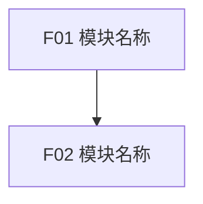
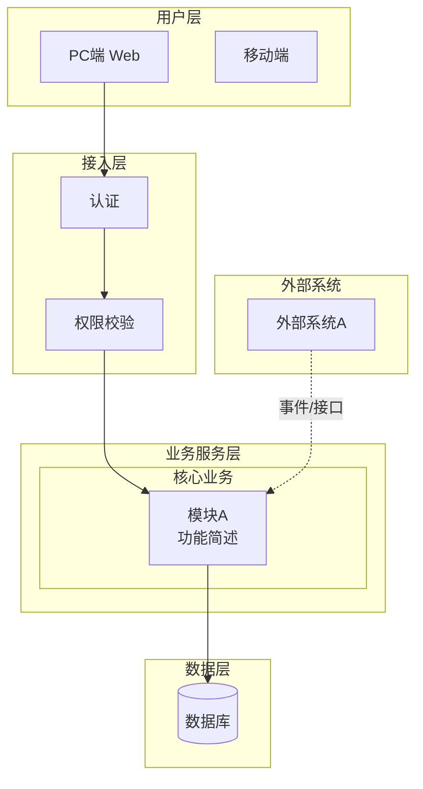
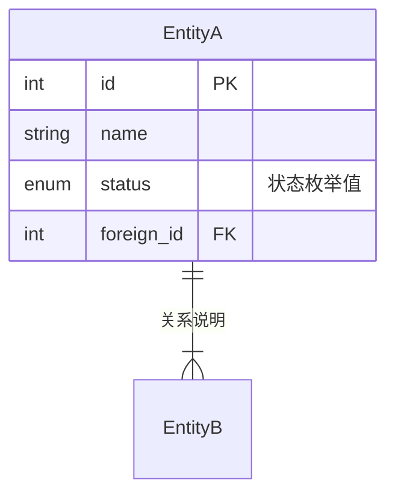
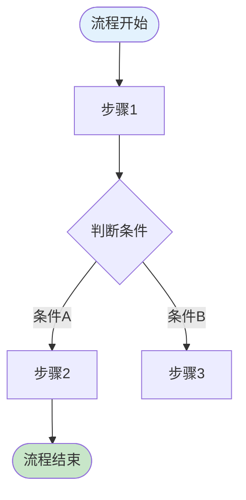
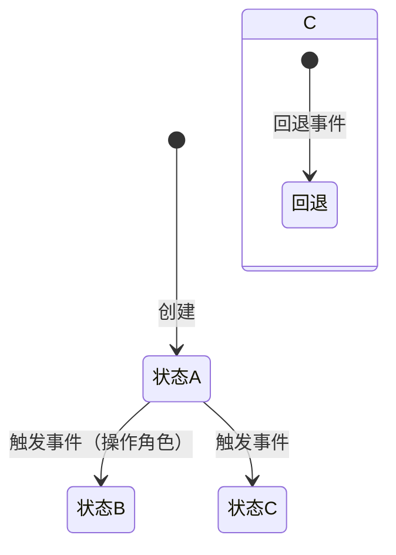

## make-prd-ch05

# 第5章 功能需求 — 生成指引

> 生成 PRD 第5章"功能需求"的指引文件。这是 PRD 中最核心、最大的章节。**写作顺序纪律：5.1 模块规划经用户确认后，才允许写 5.2/5.3。**

## 章节目标

以结构化方式详尽描述产品的功能设计，包括模块规划、产品框架、功能详解和异常处理。

> 💡 方法论基础：
> - 产品框架：《决胜B端》自顶向下设计（框架图→数据模型→流程→页面→权限→字段）
> - 数据建模：《决胜B端》ER建模三步法（找实体→梳关系→定属性）
> - 流程设计：《决胜B端》UML 建模（泳道图 + 状态机）
> - 交互设计：《决胜体验设计》设计价值观 + 四大设计原则（有用、高效、容错、启发）
> - 规则描述：《决胜B端PRD模板》五种规则类型（事实、约束、触发条件、推论、计算）

## 生成结构

### 5.1 模块规划（用户确认后才写 5.2/5.3）

模块规划依据：产品规划的"页面流程"（页面清单/主流程/状态流转/核心数据对象/权限）+ 已确认功能范围。模块数量不预设固定值，当功能行为、权限、数据对象或验收标准存在明显差异时拆成更小模块；多个能力共享同一用户流程、业务规则和工程交付边界时才合并。

```md
### 5.1 模块规划

**模块清单**：

| ID | 模块 | 模块目标 | 范围 | 主要用户/对象 | 依赖 |
|----|------|----------|------|---------------|------|
| F01 |      |          |      |               |      |

**页面/菜单功能覆盖**：

| 页面/菜单 | 模块 | 功能 | 功能说明 |
|-----------|------|------|----------|
|           |      |      |          |

**模块依赖图**（Mermaid flowchart，节点保留模块 ID）：



**建议开发顺序**（说明为什么先做、为什么后做，常见依据：基础权限、系统配置、核心数据对象、主业务流程、增强能力、报表看板）：

| 顺序 | 模块 | 原因 |
|------|------|------|
| 1 | F01 | |

**可并行开发建议**：
- 可并行模块：
- 并行前提：
- 不建议并行的模块及原因：
```

**确认规则**：模块规划必须在聊天中完整输出供用户确认（模块拆分是否合理、功能覆盖是否完整、依赖关系、开发顺序、可并行项）；用户确认前不得开始写 5.2/5.3。

### 5.2 产品框架概述

所有图表使用 Mermaid 语法生成（GitHub、VS Code、Typora 等环境可直接渲染）。

#### 5.2.1 应用架构图

使用 `graph TB` 分层，分为用户层、接入层、业务服务层、数据层、外部系统 五层；业务服务层内部用 `subgraph` 区分核心业务和平台能力；外部系统用虚线箭头 `-.->`；模块节点用 `<br/>` 换行标注功能简述。



#### 5.2.2 数据模型图

使用 `erDiagram` 语法，图后附实体说明表格。

> 💡 ER建模三步法：找到实体 → 梳理关系 → 确定关键属性



关系符号：`||--||` 一对一、`||--|{` 一对多、`}|--|{` 多对多（通过中间表）、`||--o|` 零或一对一。

**生成规则**：业务型/交易型产品 ER 图必须完整（所有核心实体和关系，关系标注精确基数，考虑未来扩展性宁可设计为 *:* 用中间表）；每个实体列出关键属性（PK/FK/状态/核心业务字段）；工具型/基础服务型简化数据模型。

#### 5.2.3 核心业务流程图

使用 `flowchart` 语法，关键节点着色。



**生成规则**：`([...])` 开始/结束（圆角）、`{...}` 判断/分支（菱形）、`[...]` 普通步骤、`[(..)]` 数据存储；关键状态着色（蓝=入口、绿=成功、红=失败/阻断、橙=等待）；涉及多角色用 `subgraph` 划分泳道。

#### 5.2.4 状态机图

使用 `stateDiagram-v2`，图后附状态转换明细表（当前状态→触发事件→目标状态→操作角色→备注）。



**生成规则**：为每个有状态流转的核心实体画一张状态机；包含正常路径和异常路径（回退、超时等）；用 `note` 标注关键约束。

#### 5.2.5 功能清单

| 子系统 | 页面 | PC端 | H5端 | App端 | 说明 |
| --- | --- | --- | --- | --- | --- |
| {子系统A} | {页面1} | ✓ | — | — | |

### 5.3 逐模块详情

按已确认的模块规划逐模块写作，**每个功能点**按 7 段式结构展开（保证产品、设计、研发和 QA 都能按功能点评审）：

```md
### 5.3.x FXX 模块名称

#### 5.3.x.y FXX-YY 功能名称

**1. 功能目标**

说明该功能点解决什么具体问题。写清使用者、触发场景、解决的问题和预期结果，不写营销化表达。

**2. 流程与页面交互**

描述入口、前置条件、页面/区域、关键组件、用户操作、系统反馈、退出或下一步。页面要素用三表描述：

**查询条件：**

| 字段名称 | 默认值 | 字段类型 | 备注 |
| --- | --- | --- | --- |
| | | 文本/下拉/日期/数字 | |

**列表字段：**

| 字段名称 | 默认值 | 字段类型 | 开放修改 | 必输项 | 备注 |
| --- | --- | --- | --- | --- | --- |
| | | | 是/否 | 是/否 | |

**操作按钮：**

| 按钮名称 | 操作说明 | 触发条件 | 权限要求 |
| --- | --- | --- | --- |
| | | | |

**3. 状态说明**

统一描述空状态、异常状态、加载状态、禁用状态、成功状态、失败状态、权限不足状态等。

| 状态 | 触发条件 | UI/系统行为 |
|------|----------|-------------|
|      |          |             |

**4. 业务规则**

> 💡 规则五种类型：事实、约束、触发条件、推论、计算

| 编号 | 规则类型 | 规则描述 |
| --- | --- | --- |
| R1 | 约束 | {如：订单金额不可为负数} |

**5. 数据要求**

说明该功能涉及的数据对象、字段、类型、必填性、默认值、来源、读写规则或约束。

| 对象 | 字段 | 类型 | 必填 | 备注 |
|------|------|------|------|------|
|      |      |      |      |      |

**6. 验收标准**

验收标准必须可测试，使用 `AC-FXX-YY-ZZ` 连续编号。每条标准应能被 QA 转化为测试用例，避免"体验良好""展示正确"等不可验证描述。

- [ ] AC-FXX-01-01：
- [ ] AC-FXX-01-02：

**7. 权限**

说明不同角色、对象、数据范围或状态下的可见、可操作、不可操作规则。若所有角色一致，也要明确说明一致范围。

| 角色/对象 | 权限 | 说明 |
|-----------|------|------|
|           |      |      |
```

**写作纪律**：
- 模块标题三级标题 `### 5.x FXX 模块名称`；功能标题四级标题 `#### 5.x.y FXX-YY 功能名称`；模块内功能编号 `FXX-01` 起连续递增，不跳号、不复用。
- 模块下不重复写"模块目标""模块功能清单""用户故事"；状态内容统一放在 `**3. 状态说明**`；功能级权限下放到每个功能内 `**7. 权限**`。
- 每完成一个功能模块，在聊天中输出确认摘要并暂停等待用户确认；用户确认后再追加到 PRD 文档。

### 5.4 异常情况处理

```md
### 5.4 异常情况处理

| 异常类型 | 异常场景 | 处理方案 |
| --- | --- | --- |
| 网络异常 | 提交操作时断网 | 本地暂存，恢复后自动重试/提示重新提交 |
| 并发冲突 | 多人同时编辑同一记录 | 乐观锁 + 冲突提示，后提交者需刷新确认 |
| 数据异常 | 外部系统返回错误数据 | 校验拦截 + 错误日志 + 人工处理入口 |
| 误操作 | 误删除重要数据 | 软删除 + 回收站 / 操作确认二次弹窗 |
| 业务异常 | 审批超时无人处理 | 超时提醒 → 升级提醒 → 自动转派 |
```

至少覆盖：网络异常、并发冲突、数据异常、误操作、业务异常 5 类；每种异常有具体处理方案，不是"待后续补充"。

### AI 功能设计（如适用）

如果产品包含 AI 功能，在对应功能详情中额外加入：

> 💡 确定性-容错性四象限分析 + 六脉神剑交互模式选择

**任务特征分析：**

| 分析维度 | 评估 |
| --- | --- |
| 确定性 | 高（目标明确）/ 低（探索性） |
| 容错性 | 高（允许出错）/ 低（必须准确） |
| 推荐交互模式 | {六脉神剑中的具体模式} |

**AI 交互设计：**
- **交互模式**：{封装API / CUI嵌入GUI / Chat / Copilot / 辅助填充 / 后台自动化}
- **人机边界**：{哪些步骤AI执行、哪些需要人确认、哪些必须人操作}
- **降级方案**：{AI 不可用时的回退方案}
- **监控指标**：{准确率、使用率、弃用率等}

## 不同产品类型的侧重差异

| 功能类型 | 5.2 侧重 | 5.3 侧重 | 5.4 侧重 |
| --- | --- | --- | --- |
| 业务型 | ER图+流程图+状态机都必须完整 | 每个模块的角色交互和审批流程 | 审批异常、数据一致性 |
| 工具型 | 简化模型，强调使用流程 | 操作效率和快捷方式 | 数据丢失防护、撤销操作 |
| 交易型 | ER图+交易流程图+状态机 | 交易闭环各环节的规则 | 支付异常、库存并发、对账 |
| 基础服务型 | API结构+调用流程 | 接口规范和参数说明 | 服务降级、限流、重试 |

## 质量标准

- [ ] 5.1 模块规划已在聊天中输出并获得用户确认
- [ ] 5.2 至少包含系统框架图和功能清单
- [ ] 5.2 业务型/交易型产品有完整 ER 模型
- [ ] 5.2 有状态流转的实体都有状态机
- [ ] 5.3 每个功能按 7 段式（功能目标/流程与页面交互/状态说明/业务规则/数据要求/验收标准/权限）
- [ ] 5.3 页面描述用三表（查询条件+列表字段+操作按钮）
- [ ] 5.3 规则按五种类型分类
- [ ] 5.3 验收标准用 AC 编号，可被 QA 转化为测试用例
- [ ] 5.4 至少覆盖 5 类异常场景
- [ ] AI 功能（如有）使用了四象限+六脉神剑框架
